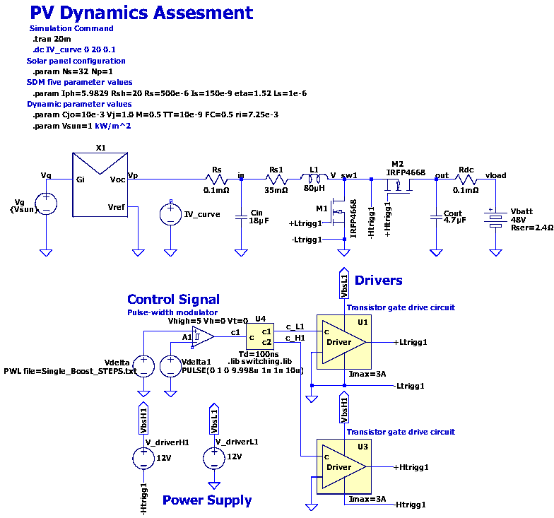

# PV_string_dynamics-Boost-Converter-Interaction

LTSpice simulation framework for studying the dynamic interaction between a photovoltaic (PV) string and a synchronous boost converter under duty-cycle step perturbations.

The goal is to characterize the PV-converter system transient response by applying controlled step stimuli around an operating point, enabling impedance extraction and linearity assessment directly from time-domain waveforms.



## Repository Structure

```
PV_string_dynamics-Boost-Converter-Interaction/
├── LTSpice_files/
│   ├── PV_BoostConverter.asc           # Main LTSpice schematic
│   ├── PWM.asy                         # PWM generator symbol
│   ├── SDM_PV_model.asy                # Enhanced single-diode model symbol
│   ├── SDM_PV_model.cir                # Enhanced single-diode model (encrypted)
│   ├── Single_Boost_STEPS.txt          # PWL duty-cycle perturbation signal
│   ├── dead_time.asy                   # Dead-time & complementary gate symbol
│   └── switching.lib                   # Switching library for power electronics
├── .gitignore
├── README.md
├── LICENSE
└── schematic_overview.png              # Annotated schematic screenshot 
```

## Circuit Description

The circuit consists of three main blocks:

**PV Source (X1)** — An enhanced single-diode model (eSDM) subcircuit representing a PV string with Ns=32 series cells and Np=1 parallel string (SOLBIAN SP16L cells). The dynamic behavior of the P-N junction is captured by three bias-dependent elements — differential conductance, diffusion capacitance, and junction capacitance — using the Berkeley SPICE semiconductor diode model instead of the ideal Shockley diode. Parameters are identified once from combined I–V and impedance-spectroscopy measurements and adapt automatically to the operating point (see the companion paper below). The model is distributed as an encrypted subcircuit (`SDM_PV_model.cir`) while the underlying research is still evolving; it simulates normally in LTspice but its internal implementation is not human-readable. The symbol exposes four pins: `Gi+`/`Gi-` (irradiance input) and `Vpv+`/`Vpv-` (PV terminal), both referenced to circuit ground in this schematic.

**Synchronous Boost Converter** — Built around two IRFP4668 MOSFETs (M1 low-side, M2 high-side) with 80 µH inductor, 18 µF input capacitor, and 4.7 µF output capacitor. Switching frequency is 100 kHz with 100 ns dead time. The output is loaded by a 48 V battery model (with 2.4 Ω series resistance). Gate drivers (U1, U3) are powered by independent 12 V supplies.

**Control Signal** — A comparator-based PWM modulator (A1) compares the duty-cycle reference (`Vdelta`) against a 100 kHz sawtooth. The `Vdelta` signal is loaded from an external PWL file (`Single_Boost_STEPS.txt`), allowing arbitrary duty-cycle waveforms without modifying the schematic.

### Key Parameters

Converter parameters (Table I of the companion paper):

| Parameter | Value | Description |
|-----------|-------|-------------|
| fsw | 100 kHz | Switching frequency |
| L1 | 80 µH | Boost inductor |
| Cin / Cout | 18 µF / 4.7 µF | Input / output capacitance |
| Vbatt | 48 V | Battery voltage |
| Rser | 2.4 Ω | Battery series resistance |
| Td | 100 ns | Dead time |
| M1, M2 | IRFP4668 | Low/high-side MOSFETs |

Enhanced SDM parameters for the SOLBIAN SP16L cell (Table II of the companion paper), identified from combined I–V and impedance-spectroscopy (IS) measurements at 932 W/m²:

| Parameter | Value | Description |
|-----------|-------|-------------|
| Ns, Np | 32, 1 | Series cells, parallel strings |
| Iph | 5.9829 A | Photogenerated current |
| Is | 6.82 µA | Saturation current |
| eta | 1.283 | Ideality factor (static) |
| Rsh | 20 Ω | Shunt resistance |
| Rs | 500 µΩ | Series resistance |
| ri | 26.3 mΩ | Internal resistance |
| TT | 60.4 µs | Transit time |
| Cjo | 2.3 mF (identified) | Junction capacitance — swept in the sensitivity study (see below) |
| Vj | 0.5003 V | Built-in potential |
| M | 0.5998 | Grading coefficient |
| FC | 0.5903 | Forward-bias depletion capacitance coefficient |
| Ls | 1 µH | Parasitic inductance (ribbon/connector) |
| Vsun | 1 kW/m² | Irradiance |

## Simulation Guide

The nominal duty cycle δ₀ = 0.77 places the operating point at the MPP identified for this string (V_PV = 12.64 V, I_PV = 5.38 A, P_PV ≈ 68.0 W at 1 kW/m²), via the boost relation:

$$\delta_0 = 1 - \frac{V_{PV}}{V_{out}}$$

The schematic directive is:

```
.tran 0 70m 4m startup
```

which runs a 70 ms transient and skips the first 4 ms as a start-up transient before recording. Run it directly — `Vdelta` already points to `Single_Boost_STEPS.txt`. Plot signals of interest: `V(Vp)`, `-Ix(X1:voc)` (PV output current), `I(L1)`, `V(vload)`, `V(V_sw1)`.

### Parametric Sensitivity Sweep

Two mutually-exclusive `.step param` blocks are provided in the schematic (toggle with `;`):

- **SDM vs. eSDM comparison** (the case compared in Figs. 4–7 of the paper):
  ```
  .step param Cj0 list 0 2.3e-3
  .step param L_s list 1e-18 1e-6
  ```
  `Cj0=0, L_s≈0` reduces the model to the conventional static five-parameter SDM; `Cj0=2.3mF, L_s=1µH` activates the enhanced dynamic model (eSDM) with the experimentally identified junction capacitance.

- **Cj0 sensitivity sweep** (Section IV-D / Table III of the paper — currently active):
  ```
  .step param Cj0 list 0 2.3e-3 4.6e-3 9.2e-3 18.4e-3
  ```
  Zero, one, two, four, and eight times the identified Cj0, covering the range from conventional PERC cells up to modern heterojunction (HJT) technologies.

Only one `.step param` group should be active (no `;` prefix) at a time.

### What to Expect

`Single_Boost_STEPS.txt` implements a four-phase protocol around **δ₀ = 0.77**:

```
Phase 0 (0–25 ms)   I–V characterization: slow linear ramp δ 0.10 → 0.90
Phase 1 (25–35 ms)  Fast return to MPP and settling at δ₀ = 0.77
Phase 2 (35–51 ms)  Small-signal P&O steps, Δδ = ±0.03  → δ = {0.74, 0.77, 0.80, 0.77}
Phase 3 (51–67 ms)  Large-signal P&O steps, Δδ = ±0.06  → δ = {0.71, 0.77, 0.83, 0.77}
Phase 4 (67–70 ms)  Final hold at δ₀, confirms return to steady state
```

Each step in Phases 2–3 is held for 4 ms. The paper's Figs. 4–7 focus on the transition window around Phase 1/2 to compare the static SDM and eSDM responses; the full 70 ms run also supports the Cj0 sensitivity metrics reported in Table III (peak transient current and 2% settling time).

## Modifying the PWL Stimulus

All perturbation parameters are in `LTSpice_files/Single_Boost_STEPS.txt`. To adapt for a different operating point:

1. **Change the center duty cycle (δ₀):** Replace occurrences of `0.77` with your value from the I–V curve analysis.
2. **Change the perturbation amplitude:** The default is ±0.03 for the small-signal phase and ±0.06 for the large-signal phase.
3. **Change the hold time:** Each step currently holds for 4 ms. If your converter has a slower response (larger L or C, or higher Cj0), increase the hold intervals accordingly — Table III shows settling time growing from 0.2 ms (static SDM) to 3.2 ms at the highest Cj0 tested.

## Requirements

- **LTSpice XVII** (or newer) — available free from [Analog Devices](https://www.analog.com/en/design-center/design-tools-and-calculators/ltspice-simulator.html).
- Place the `.asc` schematic, `.asy` symbol, `.cir`/`.lib` model files, and PWL file in the same directory, or update the file paths in the schematic accordingly.

## Companion Paper

This repository is the simulation framework accompanying:

> C. Pavón-Vargas and G. Petrone, "Impact of Photovoltaic String Dynamic Modeling on Boost Converter Transient Interaction," presented at PEMC 2026, Tallinn, Estonia.

The enhanced single-diode model (eSDM) implemented here was identified and validated at the cell level in:

> C. Pavón-Vargas, L. E. Garcia-Marrero, and G. Petrone, "A Unified Model for Characterization of Photovoltaic Sources," IEEE Transactions on Industrial Electronics, 2026, doi: [10.1109/TIE.2026.3732421](https://doi.org/10.1109/TIE.2026.3732421).

## License

This project is licensed under the MIT License — see [LICENSE](LICENSE) for details.
